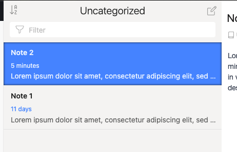
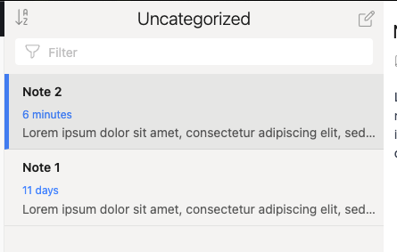
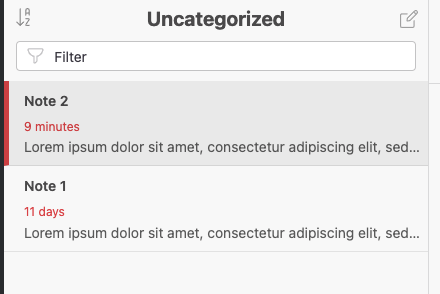
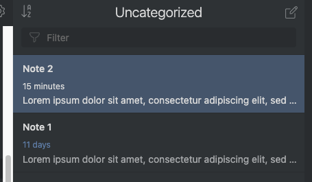
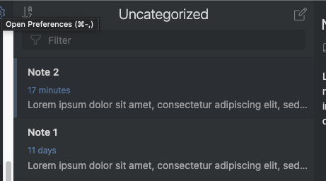
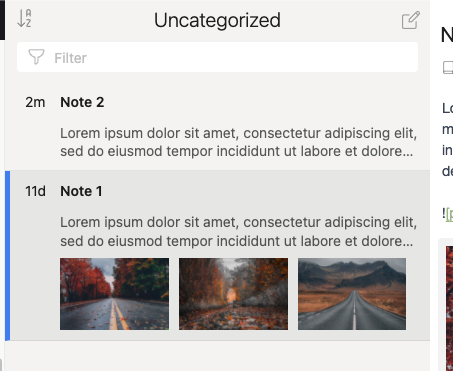
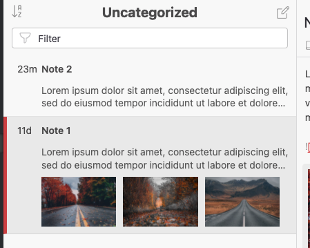

# Inkdrop Selected Note Left Border

## Overview
This plugin changes the style for selected notes.  By defualt, Inkdrop will change the entire background of a selected note in the note list.  This plugin changes the styling to instead apply a border to the left, and darken the rest of the background slightly.

### Before



* Pictured: Inkdrop default light UI Theme

### After



* Pictured: Inkdrop default light UI Theme



* Pictured: [Bera Light UI](https://github.com/TaylanTatli/inkdrop-bera-light-ui-theme)

## Caveats

1. To make this theme compatible with as many themes as possible, the selected note color is reused as the left border color.  This means that this change will look much nicer on themes with a large contrast between the selected note background color and the other notes.
    - For example, Inkdrop's default dark UI has a small contrast difference between the selected note and other notes, so this change will not render well if that theme is used.  See below:




## Other Notes

Looks great with the [Multiple Thumbnail List and Short Date Plugin](https://github.com/ryanlutgen/multiple-thumbnail-list-and-short-date/tree/multiImagePreview)




* Pictured: Inkdrop default light UI Theme



* Pictured: [Bera Light UI](https://github.com/TaylanTatli/inkdrop-bera-light-ui-theme)

## Install

```sh
ipm install selected-note-left-border
```

## Changelog

### 0.1.0

- Initial release